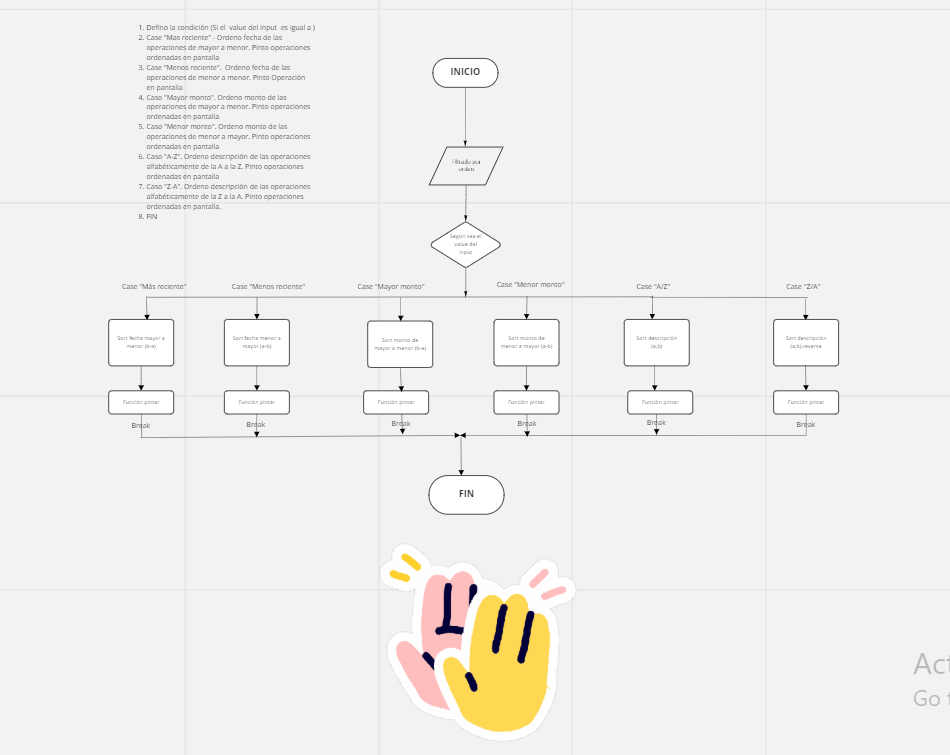

# Ahorradas

---

El presente proyecto consiste en una página, la cual te permitirá llevar un control de tus finanzas, en ella podrás registrar tus ingresos y tus gastos, personalizar las categorías, filtrar las operaciones, visualizar un resumen de tus ganancias y tus gastos por categorías y también por mes.

---

## Deployado 🚀

[Enlace al proyecto de ahorradas ](https://lorepetriella.github.io/proyecto-ahorradas/)

## Construido con 🛠️

- HTML5
- CSS
- JavaScript
- [Bootstrap](https://getbootstrap.com/)

## Funcionalidades ⚙️

### Generales

- Alternar entre modo claro y modo oscuro
- Mostrar las diferentes vistas
- Guardar los datos en el almacenamiento local del navegador

### Operaciones

- Agregar, editar y eliminar operaciones
- Muestra el balance general de las operaciones realizadas (ganancias, gastos, total)

### Categorías

- Agregar, editar y eliminar categorías

### Filtros

- Filtrar operaciones realizadas por:
  - Tipo de operación (gasto, ganancia o ambas)
  - Categoría a la que pertenece
  - Fecha de realización (a partir de la fecha seleccionada
- Ordenar las operaciones realizadas por:
  - Fecha de realización (más y menos reciente)
  - Monto (mayor y menor)
  - Descripción (en orden alfabético creciente y decreciente)

### Reportes

- Mostrar un resumen con los siguientes datos:
  - Categoría con mayor ganancia
  - Categoría con mayor gasto
  - Categoría con mayor balance
  - Mes con mayor ganancia
  - Mes con mayor gasto
- Mostrar totales por categoría (gastos, ganancia y balances)
- Mostrar totales por mes (gastos, ganancia y balances)

## Pseudocódigo y DFD 📌

- Diagrama de Flujos y Pseudocódigo del filtro por órden.

## 

## Autores 👩🏽‍💻

- Lore Petriella - [LorePetriella](https://github.com/LorePetriella)
- Stefania Diaz - [StefaniaDiazV](https://github.com/StefaniaDiazV)

---

El proyecto cuenta con diseño responsive y accesibilidad para mejorar la experiencia del usuario.

⌨️ con ❤️ por Stefa y Lore 😊
